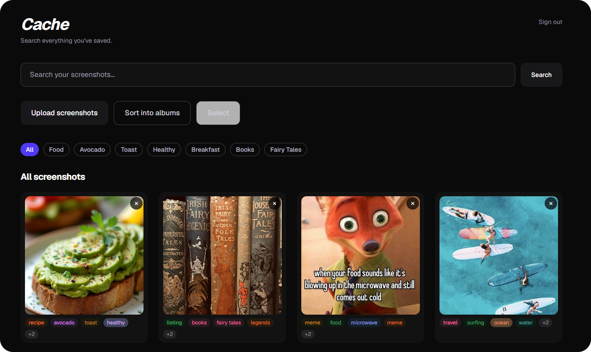
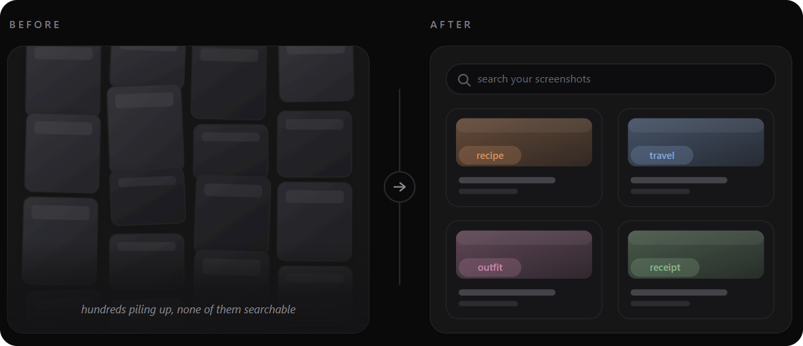
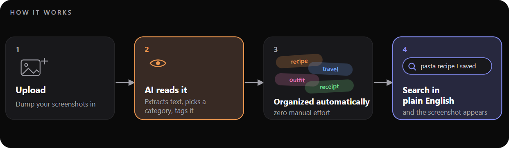
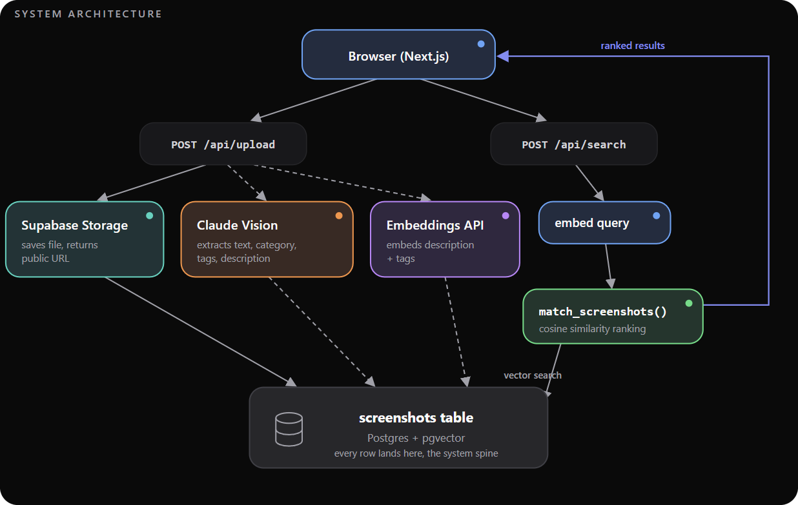

# Cache

**Stop scrolling. Start searching.**

You've got hundreds of screenshots - recipes, travel plans, receipts, outfits - and no real way to find any of them. Cache reads every screenshot with AI, works out what it is, and lets you search your whole camera roll in plain English. You don't have to remember *when* you saved something, just *what* it was.

**[Try it live →](https://cache-cacheshots.vercel.app)**

<p align="center">
  
</p>

---

## What it does

- **Search the way you talk.** "That pasta recipe I saved" or "my Seattle itinerary" - Cache goes off what you mean, not just matching keywords.
- **Organizes itself.** Every screenshot gets read, categorized, and tagged the moment you upload it. No folders, no sorting.
- **Stays private.** Your screenshots are locked to your account with row-level security - no one else can see what you upload, signed in or as a guest.

<p align="center">
  
</p>

---

## How it works

<p align="center">
  
</p>

Upload a screenshot, an AI model pulls out the text and figures out what it is, it gets tagged and indexed, and later you find it by describing it in your own words.

---

## Under the hood

<p align="center">
  
</p>

Next.js and Tailwind on Vercel, with Supabase handling auth, file storage, and a Postgres + pgvector database. A vision model reads each screenshot; embeddings power the semantic search. Full writeup in [docs/architecture.md](docs/architecture.md).

---

## Run it locally

```bash
git clone https://github.com/aarohigandhi/cache.git
cd cache
npm install
```

Copy `.env.example` to `.env.local` and add your keys, then:

```bash
npm run dev
```

Open [http://localhost:3000](http://localhost:3000).

---

## Who built it

- **Varnika Dokka** - the frontend: auth, onboarding, and the whole user search experience.
- **Aarohi Gandhi** — the backend and the AI pipeline that reads, tags, and organizes every screenshot.
